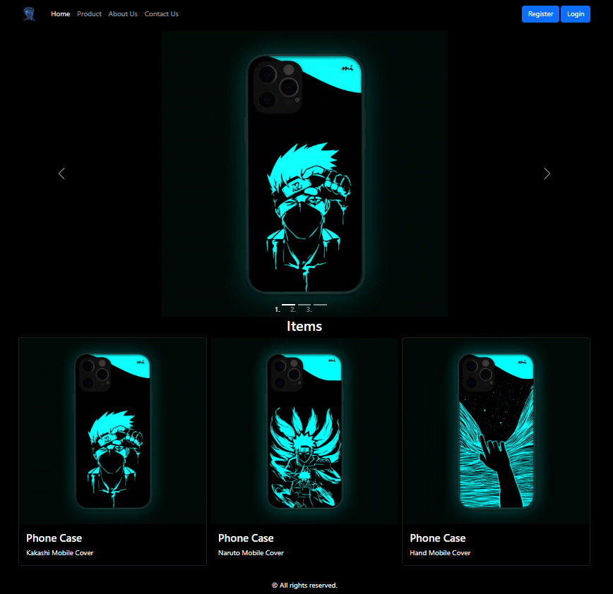
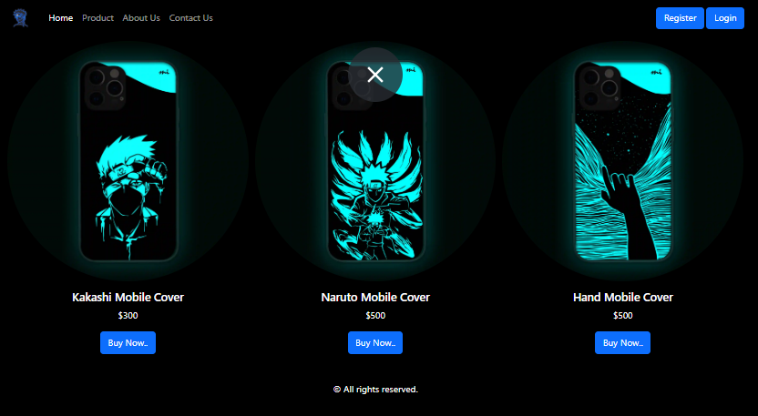
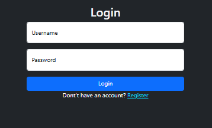
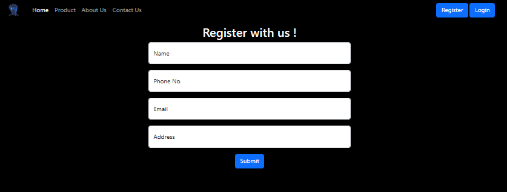
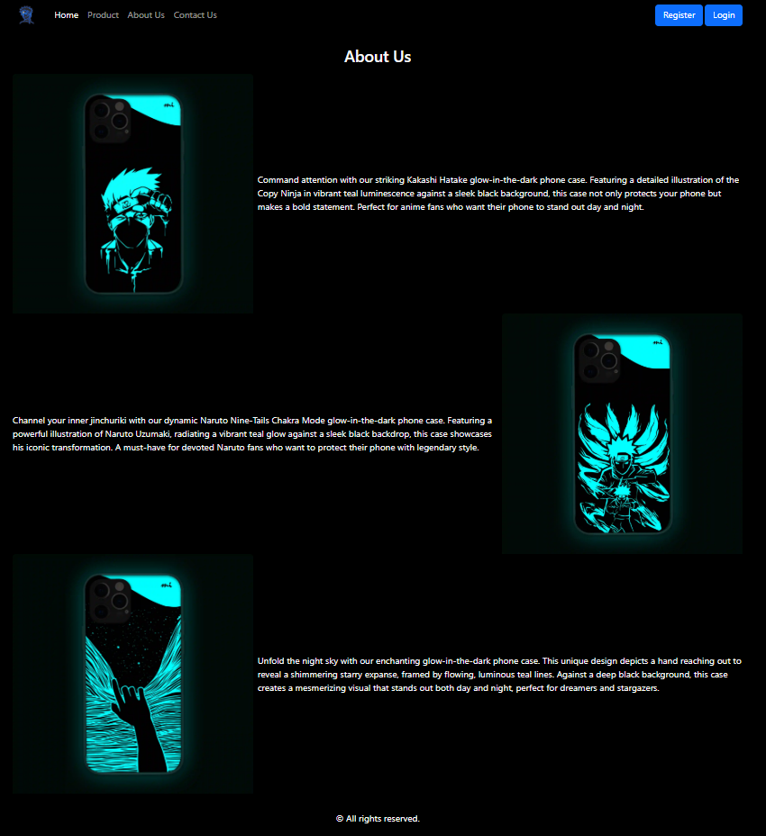
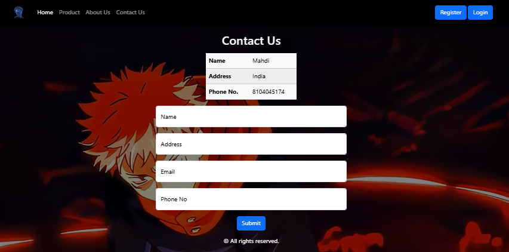

Anime Case Product Page – Static Frontend

🔗 Live Demo: (Add link after enabling GitHub Pages)
https://imahdicode.github.io/AnimeCaseProductPage/

A stylish, anime-themed product showcase website for mobile cases.
Built with pure HTML & CSS, featuring smooth layouts, vibrant visuals, and multiple supporting pages (Login, Register, About, Contact).

✨ Features

Anime-styled phone case product showcase

Fully static frontend (HTML + CSS)

Lightweight and super fast

Pages included:
Home, Product, Login, Register, About, Contact

No frameworks or dependencies

Clean UI suitable for portfolio display

📁 Project Structure
index.html → Main landing page  
product.html → Anime phone case showcase  
login.html → Login page  
register.html → Registration page  
about.html → About page  
contact.html → Contact page  
bg-anime.mp4 → Background animation/video  
screenshots/ → Project screenshots

🚀 How to Run (Local Preview)
Option 1: Open directly

Double-click index.html — it will open in your browser.

Option 2: Start a local server (recommended)

If you have Python installed:

python -m http.server 8000

Then open:

http://localhost:8000/index.html

This gives more accurate browser behavior compared to file://.

📸 Screenshots
🔗 Quick Screenshot Links

## 📸 Screenshots

<h2>📸 Screenshots</h2>

<h3>🔗 Quick Links</h3>
<ul>
  <li><a href="#home-page">Home Page</a></li>
  <li><a href="#product-page">Product Page</a></li>
  <li><a href="#login-page">Login Page</a></li>
  <li><a href="#register-page">Register Page</a></li>
  <li><a href="#about-page">About Page</a></li>
  <li><a href="#contact-page">Contact Page</a></li>
</ul>

 

<h3 id="home-page">🏠 Home Page</h3>

<h3 id="product-page">📱 Product Page</h3>

<h3 id="login-page">🔐 Login Page</h3>

<h3 id="register-page">📝 Register Page</h3>

<h3 id="about-page">📘 About Page</h3>

<h3 id="contact-page">📩 Contact Page</h3>

🛠️ Tech Used

HTML5

CSS3

(Optional) JavaScript can be added later for interactions

📌 Purpose

This project is created to practice UI/UX layout skills, explore anime-styled design, and showcase frontend abilities in a portfolio-friendly way.

📬 Contact

Feel free to open an issue or reach out for improvements or suggestions.
